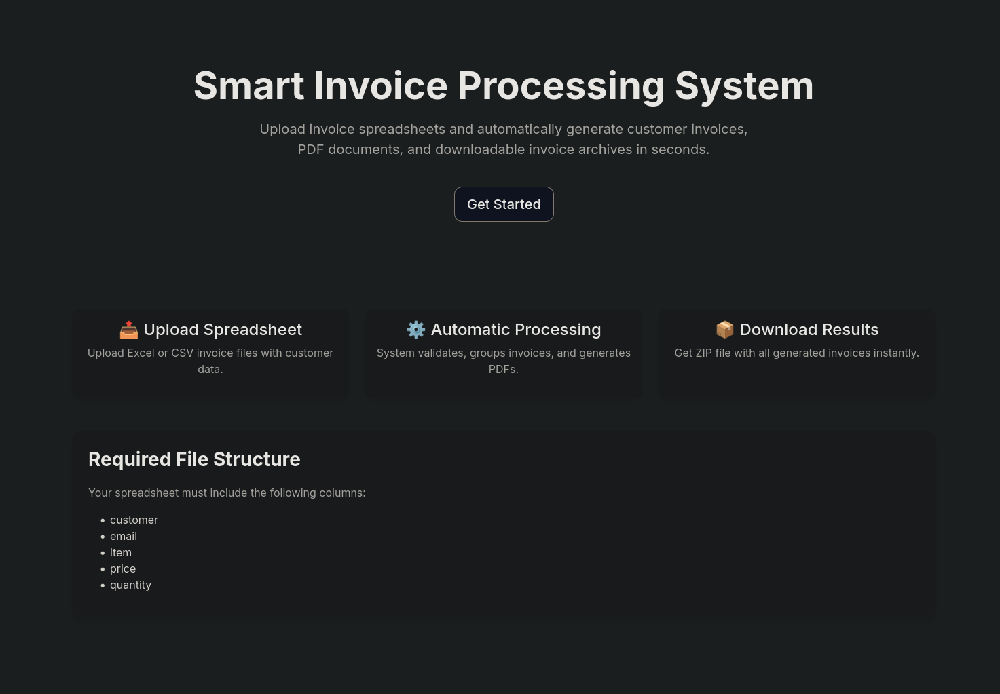
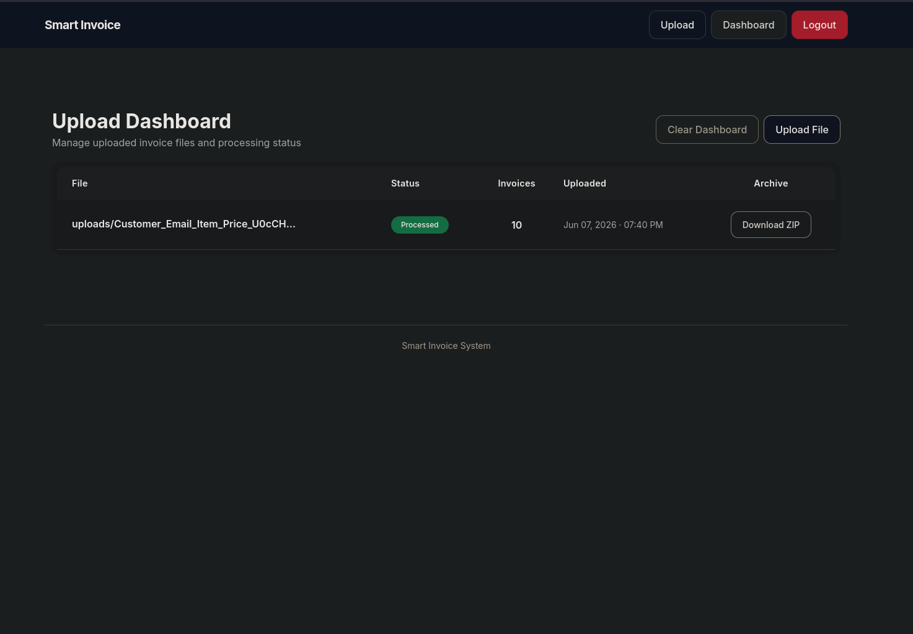

# Smart Invoice Processing System

A scalable invoice automation platform built with Django that processes spreadsheet uploads, generates customer invoices, creates PDF documents, and packages them into downloadable ZIP archives. Background task processing is powered by Celery and Redis, enabling efficient handling of large invoice batches.

---

## Overview

The Smart Invoice Processing System streamlines invoice generation by allowing users to upload spreadsheet files containing customer and invoice data. The system validates uploaded data, groups records by customer, generates invoices automatically, creates PDF documents, and provides downloadable ZIP archives containing all generated invoices.

Designed with scalability and maintainability in mind, the application leverages asynchronous task processing to ensure a responsive user experience even when handling large datasets.

---

## Features

### Authentication & User Management

* Secure user registration and authentication
* Protected dashboard access
* User-specific file and invoice management

### File Upload & Validation

* Upload invoice spreadsheets
* Support for CSV and Excel files
* Automatic data validation
* Detailed error reporting for invalid records

### Invoice Processing

* Automatic customer invoice grouping
* Invoice total calculations
* Unique invoice generation
* Bulk invoice creation

### PDF Generation

* Professional invoice PDF creation
* Customer-specific invoice documents
* Downloadable invoice files

### Archive Downloads

* Automatic ZIP archive generation
* Bulk download of generated invoices
* Secure file storage and retrieval

### Background Processing

* Asynchronous task execution with Celery
* Redis-backed task queue
* Non-blocking invoice generation
* Real-time processing status updates

---

## Technology Stack

### Backend

* Django
* PostgreSQL
* Celery
* Redis

### Infrastructure

* Docker
* Docker Compose

### File Processing

* Pandas
* OpenPyXL

### PDF Generation

* ReportLab

---

## System Architecture

```text
User Upload
     │
     ▼
Django Application
     │
     ▼
Celery Task Queue
     │
     ▼
Invoice Processing
     │
     ├── PDF Generation
     ├── ZIP Archive Creation
     └── Database Updates
     │
     ▼
User Dashboard
```

---

## Project Structure

```text
smart_invoice_app/
│
├── core/
├── user/
├── uploaded_file/
├── invoice/
├── invoice_item/
│
├── templates/
├── static/
├── media/
├── screenshots/
│
├── Dockerfile
├── docker-compose.yml
├── requirements.txt
└── manage.py
```

---

## Environment Variables

Create a `.env` file in the project root:

```env
SECRET_KEY=your_secret_key
DEBUG=False

DATABASE_URL=postgres://postgres:postgres@db:5432/smart_invoice_db
DB_HOST=
DB_PORT=
DB_NAME=
DB_USER=
DB_PASSWORD=

CELERY_BROKER_URL=redis://redis:6379/0

JWT_SIGNING_KEY=your_secret_key
```

---

## Running with Docker

### Build and Start Services

```bash
docker compose up --build
```

### Run in Background

```bash
docker compose up -d --build
```

### Stop Services

```bash
docker compose down
```

### Remove Volumes

```bash
docker compose down -v
```

---

## Screenshots

### Landing Page



### Dashboard


 
---

## Database Setup

Apply migrations:

```bash
docker compose exec web python manage.py migrate
```

Create a superuser:

```bash
docker compose exec web python manage.py createsuperuser
```

---

## Accessing the Application

Application:

```text
http://localhost:8000
```

Django Admin:

```text
http://localhost:8000/admin
```

---

## Development Workflow

1. Upload invoice spreadsheet
2. System validates uploaded data
3. Celery processes invoices in the background
4. PDF invoices are generated
5. ZIP archive is created
6. User downloads completed archive from dashboard

---

## Future Enhancements

* Email invoice delivery
* REST API integration
* Invoice templates customization
* Audit logging
* Multi-tenant support
* Cloud storage integration
* Advanced reporting dashboard

---

## License
MIT License
